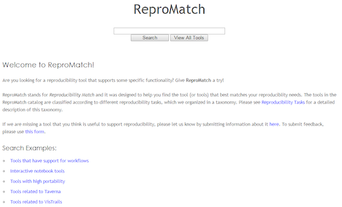

ReproMatch
==========

 

[ReproMatch](http://repromatch.engineering.nyu.edu/tools/search/) is a website designed to help you find the tool that best matches your reproducibility needs. Different tools are classified according to different reproducibility tasks, which are organized in a taxonomy. The website uses the [Django CMS](https://www.django-cms.org/) software, and [Apache Solr](http://lucene.apache.org/solr/) for search. It can be run again on different machines or in the cloud.

ReproZip Package
----------------

The ReproZip package is available [here](https://nyu.box.com/s/zmjo0csskip4s3qfpmwn7lcowkyh79v7) (58 MB).

How to Reproduce
----------------

The web application can be started as follows:

    $ reprounzip docker setup repromatch.rpz repromatch/
    $ reprounzip docker run repromatch/ --docker-option=-p --docker-option=8000:8000

Note that you need to pass `-p 8000:8000` to Docker for it to expose the port from the container. You can then access your local ReproMatch application at `http://IP:8000/`, where `IP` is your docker-machine's IP address (which can be retrieved by running `docker-machine ip`).

How to Run in the Cloud
-----------------------

Running the website in a cloud server is just a matter of provisioning and using a cloud instance. For example, using [docker-machine](https://docs.docker.com/machine/) to run on [AWS](https://aws.amazon.com/), you can use the following:

    $ docker-machine create --driver amazonec2 --amazonec2-access-key AWS_ID --amazonec2-secret-key AWS_KEY aws01
    $ eval $(docker-machine env aws01)
    $ reprounzip docker setup repromatch.rpz repromatch-aws/
    $ reprounzip docker run -d repromatch-aws/ --docker-option=-p --docker-option=80:8000 
    $ docker ps

where `AWS_ID` is the AWS Access Key ID and `AWS_KEY` is the AWS Secret Access Key.
